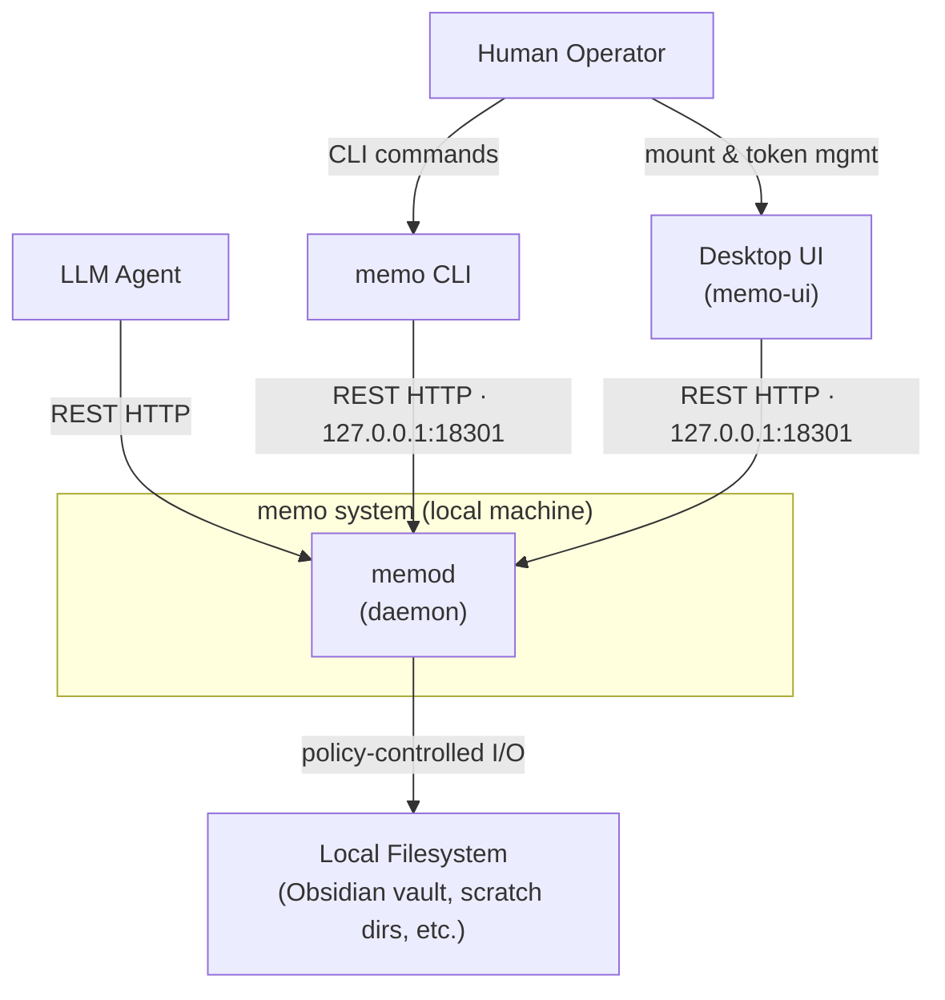
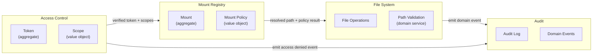
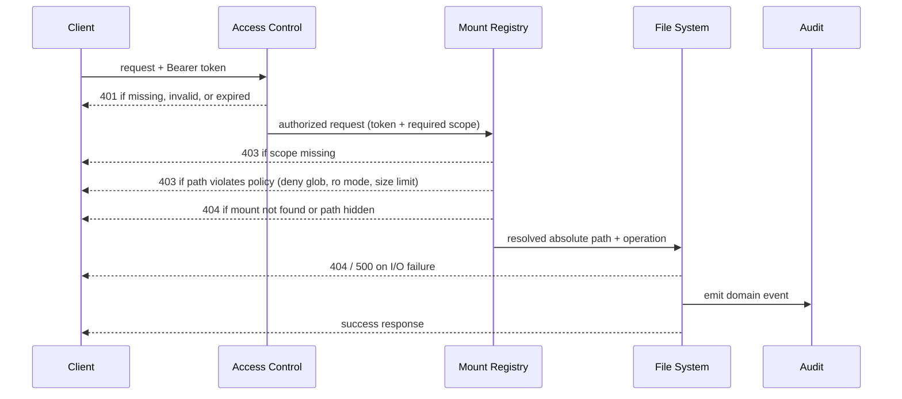

# memo — Architecture

## System Context

`memo` is a local daemon that mediates all filesystem access between clients and the underlying filesystem. No client ever touches the filesystem directly. All access is policy-enforced and authenticated.

**Key properties:**

- Daemon binds to loopback only (`127.0.0.1`) — no external network surface
- All clients authenticate with bearer tokens; all operations are scope-checked
- Every operation (success or failure) is appended to an audit log

---

## Bounded Contexts

The system is divided into four bounded contexts. Each owns its domain concepts and enforces its own invariants. Inter-context coordination happens through application services — not through shared mutable state.

| Context | Responsibility |
|---------|---------------|
| **Access Control** | Token lifecycle, scope resolution, authentication decisions |
| **Mount Registry** | Mount configuration, policy enforcement, path resolution |
| **File System** | File I/O — read, write, list, search, atomic operations |
| **Audit** | Operation recording, log querying, retention |

---

## Components

| Component | Role | Consumes |
|-----------|------|----------|
| `memod` | Daemon — all filesystem I/O; auth, policy, fs ops, audit | filesystem, SQLite |
| `memo` | CLI client — human and agent interface | `memo-client` |
| `memo-ui` | Desktop admin app — mount and token management, audit log viewer | `memo-client` |
| `memo-client` | Shared typed HTTP client library | `memo-core` |
| `memo-core` | Domain model — aggregates, value objects, repository interfaces, domain events | (none — pure logic) |

`memo-core` is the dependency inversion point: `memod` depends on it for domain types and repository interfaces; implementations live in `memod`. This allows `memo-client` and `memo-ui` to share types without pulling in daemon internals.

---

## Request Lifecycle

Every authenticated request follows this path through the daemon:

Path validation runs in two phases:

1. **Structural** (no I/O) — enforced by value object constructors: reject `..`, absolute paths, null bytes, malformed mount prefix
2. **Canonical** (requires I/O) — enforced by `PolicyEngine`: canonicalize path, verify it stays within mount root, detect symlink traversal, apply glob policies

---

## Runtime Topology

### Processes and Ports

| Process | Bind address | Launch mechanism |
|---------|-------------|-----------------|
| `memod` | `127.0.0.1:18301` (default) | `launchctl` on macOS (`~/Library/LaunchAgents/io.github.ch37n1.memo.memod.plist`) |
| `memo` | — (outbound only) | run directly by human or agent |
| `memo-ui` | — (outbound only) | standard macOS `.app` bundle |

### File Locations

| Resource | Default path |
|----------|-------------|
| Config | `~/.config/memo/config.toml` |
| Database | `~/.local/share/memo/memo.db` |
| Daemon log | `~/.local/state/memo/memod.log` |
| Audit log | `~/.local/state/memo/audit.log` |
| Bootstrap token | `~/.config/memo/bootstrap.token` |
| PID file | `$XDG_RUNTIME_DIR/memo/memod.pid` |

Paths follow the [XDG Base Directory Specification](https://specifications.freedesktop.org/basedir-spec/latest/). All paths are overridable via `config.toml`.

### Data Stores

| Store | Purpose | Location |
|-------|---------|----------|
| SQLite (WAL) | Mounts, tokens, schema migrations | `~/.local/share/memo/memo.db` |
| Append-only log | Audit entries (JSON lines) | `~/.local/state/memo/audit.log` |

Audit entries are **not** stored in SQLite — the log file is the source of truth for audit. This keeps SQLite write pressure low and makes the audit trail independently inspectable.

---

## Key Architectural Decisions

| Decision | Choice | Rationale |
|----------|--------|-----------|
| **Transport** | REST HTTP/1.1 over loopback TCP | Debuggable with `curl`; standard HTTP means agents need no special client library; loopback bind provides isolation without custom transport |
| **Domain model location** | `memo-core` (shared crate, no I/O) | Aggregates and value objects are shared between daemon and client without importing daemon internals |
| **Auth storage** | Argon2id hash in SQLite, raw token never persisted | Token is a secret; only the hash is stored; verification is CPU-bound and dispatched off the async thread pool |
| **Audit log** | Append-only file (JSON lines), not SQLite | Write-once, independently inspectable, no DB lock contention; sequential `id` from in-memory counter enables forward pagination |
| **Domain event encoding** | Internally tagged serde enum (`type` + snake_case) | Stable, explicit wire shape for audit consumers and future event subscribers |
| **Atomic writes** | Write to temp file, then `rename` | Rename is atomic on POSIX; compatible with file watchers (Obsidian); temp file cleaned up on any error |
| **Path validation split** | Value objects (structural) + PolicyEngine (canonical) | Structural checks are pure and testable without I/O; canonical checks (canonicalize, symlinks, globs) require the filesystem |
| **Module organization** | By bounded context, not technical layer | Keeps domain logic co-located; each BC has one application service coordinating its own repository and domain objects |
