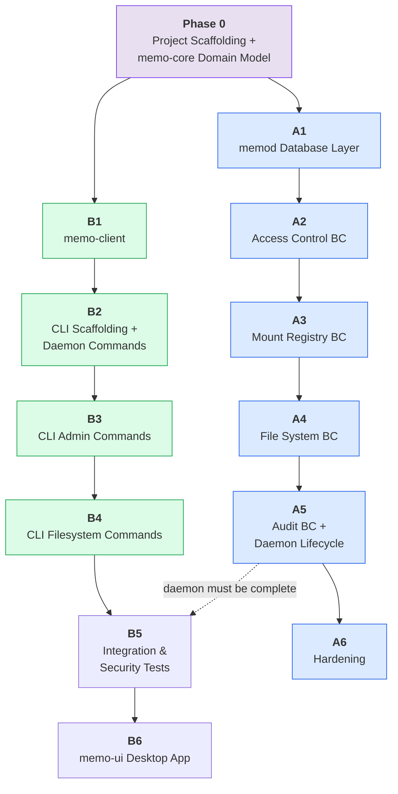

# memo v1 — Roadmap

Two parallel streams of work, synchronized at phase boundaries. **Stream A** builds the daemon (`memod`). **Stream B** builds the clients (`memo-client`, `memo` CLI, `memo-ui`). Phase 0 is collaborative — both workers share it before splitting.

Each item is a complete feature that requires its own implementation plan.

---

## Current Status

- Phase 0: **DONE**
- Phase 1: **DONE**
- Phase 2: **DONE**
- Phase 3: **DONE**
- Phase 4: **DONE**
- Stream B: **B1 DONE** (`memo-client`)
- Stream B: **B2 DONE** (`memo` CLI scaffolding + daemon commands)
- Stream B: **B3 DONE** (`memo` CLI admin commands)
- Stream B: **B4 DONE** (`memo` CLI filesystem commands)
- Stream A: **A1 DONE** (`memod` database layer)
- Stream A: **A2 DONE** (`Access Control BC`)
- Stream A: **A3 DONE** (`Mount Registry BC`)
- Stream A: **A4 DONE** (`File System BC`)

---

## Dependency Graph

**Sync point:** Stream B's integration tests (B5) require the daemon to be feature-complete through A4. By the phased structure, A is already on A5 when B reaches B5, so this is naturally satisfied.

---

## Phase 0 — Foundation -- **DONE**

> Both workers collaborate. Everything else depends on this.

### 0.1 Project Scaffolding + memo-core Domain Model

**Scope:** Set up the Cargo workspace and implement the entire shared domain model.

**Deliverables:**

- Cargo workspace root `Cargo.toml` with all workspace members and pinned dependencies
- Directory structure for all crates (empty `lib.rs` / `main.rs` stubs for crates not yet implemented)
- Dev scripts (`scripts/setup.sh`, `scripts/dev.sh`), `.gitignore`, `rustfmt.toml`, `clippy.toml`
- Pre-commit hook configuration (fmt + clippy + test)
- `memo-core` crate fully implemented:
  - Value objects: `MountName`, `RelativePath`, `MountPath`, `Scope`, `TokenId` — each with construction validation
  - Aggregates: `Mount` (with `MountPolicy`, `MountMode`, `Audience`), `Token` (with `ScopeSet`, `Expiry`)
  - Repository traits: `MountRepository`, `TokenRepository` (async, no impl)
  - Domain events: `DomainEvent` enum (all variants)
  - Error types: `ApiError`, `PolicyError`, `DbError` (thiserror)
  - Scope system: parsing (`fs:VaultKB:read`), matching, wildcard support
- Unit tests for all value object validation, scope parsing, aggregate behavior

**Why one item:** Workspace setup is small but must precede everything. `memo-core` is the dependency inversion point — every other crate imports it. Combining them avoids a trivial standalone scaffolding task.

---

## Phase 1 — Core Infrastructure

> Streams diverge. A builds the daemon's persistence layer. B builds the shared HTTP client.

### A1: memod Database Layer -- **DONE**

**Scope:** SQLite pool, WAL mode, migrations, schema tables — the persistence foundation the daemon builds on.

**Deliverables:**

- `db/mod.rs`: `sqlx::SqlitePool` initialization with `PRAGMA journal_mode=WAL` and `PRAGMA foreign_keys=ON`
- Schema migrations embedded via `include_str!`, applied at startup through a `schema_migrations` version table
- Tables: `mounts`, `tokens`, `schema_migrations` (as specified in system design Section 11)
- Connection management: pool size config, timeout handling
- Unit tests: migration idempotency, WAL mode verification

**Depends on:** Phase 0

**Status:** Completed in stream `a`.

---

### B1: memo-client -- **DONE**

**Scope:** Typed `reqwest`-based HTTP client library used by both CLI and memo-ui.

**Deliverables:**

- `MemoClient` struct: base URL, bearer token injection, configurable timeout
- Typed wrappers for all `/v1/fs/*` endpoints (ls, tree, stat, read, write, mkdir, mv, rm, cp, grep, find)
- Typed wrappers for all `/v1/meta/*` endpoints (mounts CRUD, tokens CRUD, audit query)
- Health check wrapper (`GET /health`)
- Error mapping: HTTP status codes → `memo-core` error types
- Request/response types using `memo-core` domain types (serialization with `serde`)
- Streaming support for file read/write (reqwest `Body` / `Bytes`)

**Depends on:** Phase 0 (memo-core types)

**Note:** Built against the API spec in the system design doc. Does not require a running daemon — tested with unit tests against expected serialization. End-to-end validation happens in Phase 5.

---

## Phase 2 — Authentication -- **DONE**

> A builds the auth system. B builds the CLI shell that will host all future commands.

### A2: Access Control BC -- **DONE**

**Scope:** Token storage, hash verification, bootstrap flow, auth middleware, and the token management API.

**Deliverables:**

- `SqliteTokenRepository`: implements `TokenRepository` trait over sqlx
- Argon2id hashing (token creation) and verification (per-request auth) — verify dispatched via `spawn_blocking`
- Token generation: `memo_<base62_32chars>` format, `rand`-based
- Bootstrap logic: on first start with empty `tokens` table, generate admin token with all scopes, write raw token to `~/.config/memo/bootstrap.token` (mode `0600`), print path to stderr, continue running
- Auth middleware (axum): extract `Authorization: Bearer <token>`, verify hash, check expiry, attach verified token to request extensions
- Scope checking: compare token scopes against required scope for each operation
- HTTP handlers: `POST /v1/meta/tokens` (create), `GET /v1/meta/tokens` (list), `DELETE /v1/meta/tokens/:id` (revoke)
- Minimal axum server scaffold (router with auth middleware + token endpoints + health) — this is the first runnable daemon
- Unit tests: hash/verify round-trip, scope matching, expired token rejection
- Integration test: bootstrap flow (start daemon, read token file, use token)

**Depends on:** A1 (database layer)

---

### B2: CLI Scaffolding + Daemon Commands -- **DONE**

**Scope:** The `memo` binary shell — clap app, global flags, config resolution — plus the daemon management commands that make the daemon usable.

**Deliverables:**

- `clap` app with derive API: global flags (`--json`, `--host`, `--port`, `--token`, `--mount`)
- Token resolution chain: `--token` flag → `MEMO_TOKEN` env → `~/.config/memo/tokens/<name>.token`
- Host/port resolution chain: flags → env vars → `config.toml` → default `127.0.0.1:18301`
- Config file parsing: `~/.config/memo/config.toml` (toml crate, `[daemon]` section)
- `memo daemon start`: generate and load launchd plist (`~/Library/LaunchAgents/io.github.ch37n1.memo.memod.plist`)
- `memo daemon stop`: `launchctl unload` on the plist
- `memo daemon status`: check PID file + `GET /health`
- `memo daemon logs --tail N`: read daemon log file directly
- Error handling: daemon not running → exit code 5, auth errors → exit code 2
- JSON output mode (`--json`) vs plain text mode

**Depends on:** B1 (memo-client)

**Status:** Completed in stream `b`.

---

## Phase 3 — Mount System -- **DONE**

> A builds mount registration and policy enforcement. B adds admin commands to the CLI.

### A3: Mount Registry BC -- **DONE**

**Scope:** Mount CRUD, the policy engine (the most security-critical component), and the glob cache.

**Deliverables:**

- `SqliteMountRepository`: implements `MountRepository` trait; invalidates `PolicyCache` on every write
- `PolicyCache`: `DashMap<MountName, Arc<CompiledMount>>` — compiled globs (`globset`) cached at mount load time
- `PolicyEngine` (domain service) — the 10-step path validation:
  1. Parse mount prefix (handled by `MountPath` value object)
  2. Reject invalid mount name (handled by `MountName` value object)
  3. Reject absolute paths (handled by `RelativePath` value object)
  4. Reject `..` components (handled by `RelativePath` value object)
  5. Join with mount root
  6. Canonicalize (read: full path; write: parent only + re-append filename)
  7. Verify prefix (`canonical.starts_with(mount.root_path_canonical)`)
  8. Symlink detection (`path_clean::clean` normalized vs canonical — reject if different)
  9. Apply policy globs (hide, deny-read, deny-write)
  10. Check size limits
- Read path resolution vs write path resolution (separate functions — write targets may not exist yet)
- HTTP handlers: `POST /v1/meta/mounts` (register), `GET /v1/meta/mounts` (list), `GET /v1/meta/mounts/:name` (show), `PATCH /v1/meta/mounts/:name` (update), `DELETE /v1/meta/mounts/:name` (remove)
- Unit tests: every path validation step in isolation, glob compilation, cache invalidation
- Security tests: traversal corpus (`../`, `%2e%2e%2f`, null bytes), symlink in mount root pointing outside, Unicode normalization edge cases

**Depends on:** A2 (auth middleware needed to protect mount endpoints)

---

### B3: CLI Admin Commands -- **DONE**

**Scope:** Mount management, token management, and audit log viewing from the CLI.

**Deliverables:**

- `memo mount list`, `memo mount add` (with `--name`, `--path`, `--mode`, `--audience`, `--description`, `--hide-glob`, `--deny-read-glob`, `--deny-write-glob`, `--max-read-bytes`, `--max-write-bytes`), `memo mount remove`, `memo mount show`, `memo mount update` (with partial field flags)
- `memo token list`, `memo token create` (with `--name`, `--scopes`, `--expires`), `memo token revoke`
- `memo audit` (with `--mount`, `--token-id`, `--operation`, `--result`, `--limit`, `--before`, `--after`)
- Plain text and JSON output modes for all commands
- Proper exit codes: 0 success, 1 general error, 2 auth, 3 permission, 4 not found, 5 daemon unreachable

**Depends on:** B2 (CLI scaffolding)

**Status:** Completed in stream `b`.

---

## Phase 4 — File Operations -- **DONE**

> A builds all filesystem operations. B adds the corresponding CLI commands.

### A4: File System BC -- **DONE**

**Scope:** All file I/O operations, atomic writes, text search, glob search, and their HTTP endpoints.

**Deliverables:**

- `FileSystemService` (application service): coordinates token verify → mount lookup → policy check → fs op → emit domain event
- Core operations:
  - `ls`: list directory, optional `info` flag for `index.md` summary
  - `tree`: recursive listing with configurable depth (clamped to max 10, entry cap 10,000)
  - `stat`: single path metadata + `memo_summary` from `index.md` frontmatter
  - `read`: raw file bytes, streamed via `Body::from_stream` for files > 4 MB, MIME type detection
  - `write`: raw body bytes, atomic write-by-rename, auto-create parent directories
  - `mkdir`: create directory and intermediates
  - `mv`: move/rename within same mount
  - `rm`: delete file or empty dir; `?recursive=true` for non-empty dirs
  - `cp`: mount-to-mount copy (read src → atomic write dst), scope-check on both mounts
- Atomic write implementation: `AsyncRead` → temp file (`.memo_tmp_<uuid>`) → optional fsync → rename; cleanup on error
- `grep`: regex text search (regex crate + walkdir), recursive by default, case sensitivity flag, result cap
- `find`: glob filename search (globset + walkdir), result cap
- Streaming: reads above threshold use chunked transfer; writes accept streamed body
- HTTP handlers: all `/v1/fs/*` endpoints (GET ls, GET tree, GET stat, GET read, PUT write, POST mkdir, POST mv, DELETE rm, POST cp, GET grep, GET find)
- Integration tests: ls empty dir, read/write round-trip, overwrite existing, mkdir, mv, rm non-empty without recursive (expect error), cp within mount, atomic write interrupted (temp file cleanup), concurrent writes to same path

**Depends on:** A3 (policy engine needed to validate paths before any operation)

**Status:** Completed in stream `a`.

---

### B4: CLI Filesystem Commands -- **DONE**

**Scope:** All filesystem-facing CLI commands — the primary user and agent interface.

**Deliverables:**

- `memo ls` (with `--info`, `--json`), `memo tree` (with `--depth`)
- `memo cat` (with `--json` for base64 encoding)
- `memo write` (stdin pipe and `--file` flag)
- `memo mkdir`
- `memo mv`
- `memo rm` (with `--recursive`)
- `memo cp` (mount→mount via daemon; local→mount by reading local file and calling write)
- `memo grep` (with `--case-insensitive`, `--no-recursive`, `--max-results`)
- `memo find` (with `--max-results`)
- `memo info` (stat + index.md summary)
- All commands support `--json` output
- All commands support `--mount` default mount flag to reduce repetition
- Error formatting: human-readable by default, structured JSON with `--json`

**Depends on:** B3 (builds on CLI scaffolding; admin commands provide mount setup needed for manual testing)

---

## Phase 5 — Assembly & Testing

> A finishes the daemon (audit + lifecycle). B builds end-to-end test suites. **Sync point:** B5 requires A1–A4 to be complete (the daemon must have all endpoints). A is already on A5 by this phase, so the dependency is naturally satisfied.

### A5: Audit BC + Daemon Lifecycle

**Scope:** Domain event consumption, audit log persistence, audit query API, and everything that makes `memod` a proper production daemon.

**Deliverables — Audit BC:**

- `AuditService`: consumes `DomainEvent` variants, serializes to JSON lines
- Append-only writer to `~/.local/state/memo/audit.log`; `AtomicU64` sequential counter for `id` field
- Auth failure recording (`token_id: null`)
- Query handler: filter by mount, token_id, operation, result, time range, `after_id` for forward pagination
- Background startup task: prune audit log if row count exceeds `max_audit_log_rows` (rotate to `audit.log.1`)
- HTTP handler: `GET /v1/meta/audit` (with all filter params)

**Deliverables — Daemon Lifecycle:**

- Config loading: `~/.config/memo/config.toml` parsing (daemon.bind_addr, daemon.write.fsync/dir_sync, daemon.limits.max_audit_log_rows, daemon.log_level, db_path, log_path)
- Startup sequence: config → log file → PID file → SQLite → bootstrap check → axum bind → signal handlers → audit prune task
- PID file: write to `$XDG_RUNTIME_DIR/memo/memod.pid`, clean up on shutdown
- Signal handlers: `SIGTERM`/`SIGINT` → graceful shutdown (finish in-flight requests, close DB pool, remove PID file)
- XDG directory creation: ensure `~/.config/memo/`, `~/.local/share/memo/`, `~/.local/state/memo/` exist
- Structured logging: `tracing` + `tracing-subscriber` with JSON output to log file + stderr
- `GET /health` endpoint (no auth): `{"status": "ok", "version": "0.1.0"}`
- Full axum router assembly: mount all BC handlers, apply auth middleware, request tracing

**Depends on:** A4 (all BC implementations needed for router assembly)

---

### B5: Integration & Security Tests

**Scope:** Full end-to-end test infrastructure and comprehensive test suites.

**Deliverables — Test Harness:**

- Test helper: create temp directory (mount root), temp SQLite DB, start `memod` bound to `127.0.0.1:0` (OS assigns port), return port + admin token
- Teardown: stop daemon, delete temp dirs and DB
- Helper macros/functions for common assertions

**Deliverables — Integration Test Suites:**

- `fs_ops`: ls empty dir, ls with entries, read existing file, read missing file (404), write new file, overwrite existing, mkdir, mv file, mv dir, rm file, rm non-empty dir without recursive (expect 409), cp within mount, cp across mounts
- `policy`: `..` in path (400), absolute path (400), symlink escape (403 — setup symlink in temp dir pointing outside), hide glob (file invisible in ls, 404 on direct access), deny_read glob (403), deny_write glob (403), ro mount rejects write (403)
- `auth`: missing token (401), invalid token (401), expired token (401), wrong scope (403), correct scope (200)
- `atomic`: write interrupted (temp file cleaned up, target unchanged), concurrent writes (no corruption)

**Deliverables — Security Tests (`#[ignore = "security"]`):**

- Traversal corpus: list of known attack strings (`../`, `....//`, `%2e%2e%2f`, null bytes, overlong UTF-8) — all must return `invalid_path` or `out_of_bounds`
- Symlink attack: symlink inside mount root → outside; read via symlink must be rejected
- Unicode normalization: NFC vs NFD paths handled consistently

**Depends on:** B4 (CLI commands to test through) + A4 (daemon with all endpoints)

---

## Phase 6 — Desktop App & Hardening

> A addresses issues found during integration testing. B builds the desktop admin UI.

### A6: Hardening

**Scope:** Bug fixes, edge cases, performance, and documentation catch-up.

**Deliverables:**

- Fix all bugs surfaced by B5 integration and security tests
- Edge case handling: empty file writes, zero-byte reads, very long paths, maximum directory depth, concurrent mount mutations
- Performance: verify NFR-04 (metadata ops < 50 ms), profile hot paths (Argon2 verify, glob matching, directory traversal)
- Audit log query performance with large log files
- Review and tighten all error messages for machine-readability (NFR-09)
- CLI exit code consistency (NFR-10)
- Documentation: ensure system design matches implementation, update any divergences

**Depends on:** A5 + feedback from B5

---

### B6: memo-ui Desktop App

**Scope:** Tauri v2 native macOS admin application — mount management, token management, audit log viewer.

**Deliverables — Tauri Setup:**

- Tauri v2 scaffold: `src-tauri/` with `Cargo.toml` (crate-type `staticlib`, `cdylib`, `rlib`), `main.rs`, `lib.rs`
- `tauri.conf.json`: app identifier `io.github.ch37n1.memo`, CSP (`default-src 'self'; style-src 'self' 'unsafe-inline'`), build config (Vite dev/build commands)
- `capabilities/default.json`: `core:default` permissions
- `entitlements.macos.plist`: `com.apple.security.network.client` (required for `reqwest` to reach `127.0.0.1`)
- `tauri-plugin-store` registration for admin token persistence

**Deliverables — Rust Backend:**

- Tauri `invoke` commands wrapping `memo-client`: list mounts, create/update/delete mount, list tokens, create/revoke token, query audit log
- Admin token setup flow: first-launch screen prompting for bootstrap token, stored via `tauri-plugin-store`

**Deliverables — React Frontend:**

- Vite + React + TypeScript setup
- `MountList` component: table of mounts, add/edit/remove actions
- `TokenList` component: table of tokens (no raw values), create/revoke actions
- `AuditLog` component: filterable table (by mount, operation, result, time range)
- `useMemoClient` hook: typed wrappers around Tauri `invoke` commands
- Basic file browser (read-only, tree view) — not an editor

**Depends on:** B5 (tests validate the API that memo-ui consumes) + A5 (daemon must be complete)

---

## Cross-Stream Dependencies Summary

| Item | Hard dependencies | Soft dependencies |
|------|-------------------|-------------------|
| A1 | Phase 0 | — |
| A2 | A1 | — |
| A3 | A2 | — |
| A4 | A3 | — |
| A5 | A4 | — |
| A6 | A5 | B5 (test feedback) |
| B1 | Phase 0 | — |
| B2 | B1 | — |
| B3 | B2 | — |
| B4 | B3 | — |
| B5 | B4, A4 | A5 (full daemon preferred) |
| B6 | B5, A5 | — |

**Critical path:** Phase 0 → A1 → A2 → A3 → A4 → A5 (daemon side is the bottleneck). Stream B paces itself to match and converges at Phase 5.

---

## Notes

- **Stream B during phases 2–4** builds CLI commands against the memo-client API spec without a running daemon. Unit tests validate serialization. Full end-to-end testing waits for Phase 5.
- **If Stream B finishes early** in any phase, the worker can assist Stream A (e.g., write unit tests for policy engine, help with atomic write edge cases).
- **If Stream A finishes early** in any phase, the worker can write integration test scaffolding or documentation.
- **memo-ui (B6) is the lowest-priority item.** If time is tight, the system is fully functional with just `memod` + `memo` CLI. memo-ui can be deferred to a fast-follow release.
